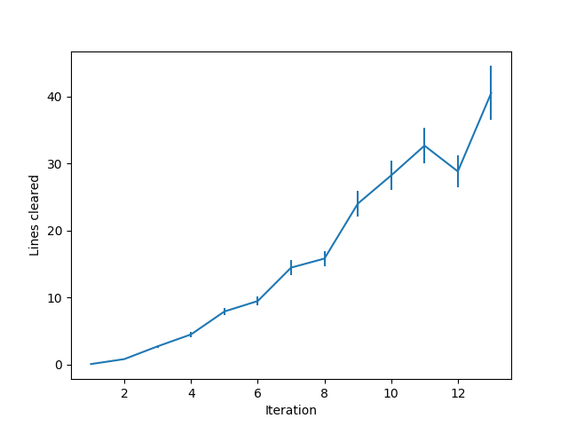

# Learning to play Tetris with Monte Carlo Tree Search and Temporal Difference Learning

My personal project for the love of Tetris.

See the agent in action [here](https://www.youtube.com/watch?v=EALo2GfZuYU)!

(Warning: Codes are a hot mess riddled with inconsistent styles and unclear namings, read them at your own risk.)

## Introduction

This project started out as a practice to apply Deep Q-Learning to Tetris, one of my favourite puzzle games of all time. 
However, I soon realized that it was almost impossible to train an agent to perform anywhere near human level 
due to the sparsity and long-term dependency of the rewards in Tetris (imagine how many actions you need to perform to clear even one 
line!). It was also around that time AlphaGo beat Lee Sedol in a dominating fashion that reignited my hopes for a better agent. Also,
I believed that a model based approach should improve significantly compared to model free approaches (Q learning, policy gradients etc.). So here it is, the MCTS-TD agent inspired by AlphaGo specializing in the game Tetris.

## How is this related to AlphaGO/Zero?
At the core of AlphaGo, the agent tries to search the game tree base on upper confidence bound applied to trees (UCT). Unlike vanilla MCTS which has to simulate the entire game to estimate the value of current state, AlphaGo uses a neural network to inference the value (winning probability) and the policy (likely next moves) of the current state to calculate the upper confidence bound for each moves. In my agent I used exponential moving averages and variances with initial values from the neural network to calculate the upper confidence bound based on central limit theorem which I believe is more appropriate for single player games with unbounded rewards. Another difference is that AlphaGo uses the final scores of each game as the training targets while this agent uses a bootstrapped target, hence Temporal Difference Learning.

## How is this different from other Tetris Bots?
Most of the super-human performing Tetris bots seen on youtube or other games use heuristics (number of holes, height of each column, smoothness of the surface stc.) to model the reward. Using heuristics can substantially simplify the problem since the rewards are now much denser (you get a reward for each piece you drop) and are highly correlated with the final score. However, such handcrafted rewards can bias your agents toward the target you set (minimize holes in the board or height of the column) instead of the true target (clearing lines). Furthermore, such heuristics do not generalize beyond the game Tetris meaning that you have to handcraft rewards for each game you want your bot to play. This agent differs from those bots in the sense that it can be applied to any environment satisfying certain requirements.

## Prerequisite

* torch==1.0.0 
* numpy==1.14.2
* numba==0.39.0
* tables==3.4.2
* matplotlib==2.1.2
* tensorflow==1.12.0 (not supported anymore, switch to PyTorch instead)

You'll also need the Tetris environment from [here](https://github.com/hrpan/pyTetris)
and modify the `sys.path.append` in `play.py` to include the path of pyTetris.

## How to run it?

* `play.py` script for self-play or manual play
* `train.py` script for training the neural network
* `tools/plot_score.py` script for plotting the score curve
* `tools/plot_loss.py` script for plotting the loss curve
* `tools/replay.py` GUI for replaying

The default routine is written in `cycle.sh`, if you are unsure what to do simply use `./cycle.sh` and things should get going.

## Results
In the default routine (`cycle.sh`), each iteration consists of 100 games of selfplay with 300 MCTS simulations per move to generate the 
training data and 1 benchmark game with 1500 MCTS simulations per move to test the performance of the agent.

 

Left one is the normal (300 simulations) selfplay, right one is the benchmark (1500 simulations) selfplay. As a baseline, vanilla MCTS agent (no neural network) has an average score about 7 lines with 300 simulations per move.

As can be seen in the graphs, the agent is still improving even after 13 iterations (1300 games), however, it takes more than 10 hours to finish one iteration on my potato so I had to terminate it early. To the best of my knowledge, this result beats all non-heuristic agents.

## Further Readings
1. [Reinforcement Learning: An Introduction](https://mitpress.mit.edu/books/reinforcement-learning-second-edition) (Must read for anyone interested in reinforcement learning)
2. [Playing Atari with Deep Reinforcement Learning](https://arxiv.org/abs/1312.5602) (First deep reinforcement learning)
3. [A Survey of Monte Carlo Tree Search Methods](https://ieeexplore.ieee.org/document/6145622) (Great review of MCTS)
4. [Transpositions and Move Groups in Monte Carlo Tree Search](https://ieeexplore.ieee.org/document/5035667) (An important branch reduction technique for MCTS)
5. [Bandit Algorithm](http://banditalgs.com/) (Contains almost everything you need to know about bandit-like algorithms)
6. [Deep Learning](https://www.deeplearningbook.org/) (Great introductory book on deep learning)
7. [Mastering the game of Go without human knowledge](https://www.nature.com/articles/nature24270) (Original AlphaGo Zero paper)
8. [Deep Reinforcement Learning: Pong from Pixels](http://karpathy.github.io/2016/05/31/rl/) (Great introductory article on reinforcement learning)
