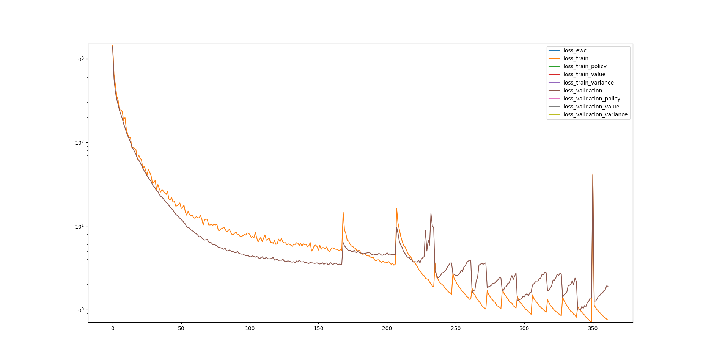
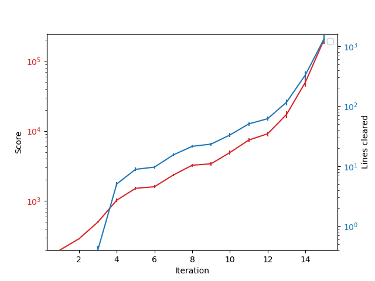
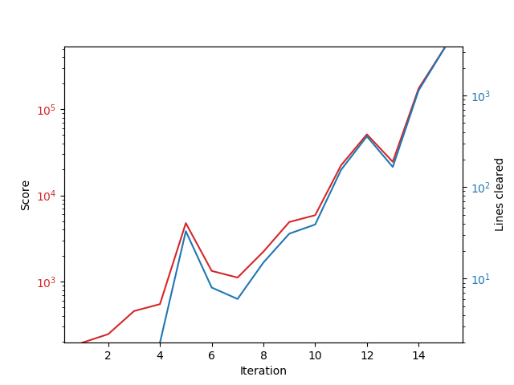
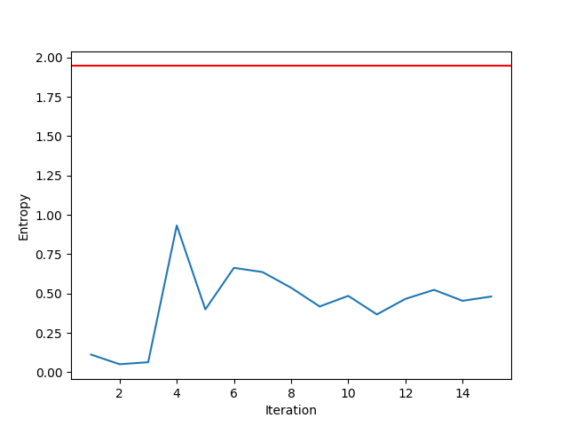
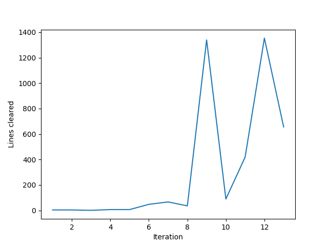

# Learning to play Tetris with Monte Carlo Tree Search and Temporal Difference Learning

My personal project for the love of Tetris.

See the agent in action [here](https://www.youtube.com/watch?v=EALo2GfZuYU)!

(Warning: Codes are a hot mess riddled with inconsistent styles and unclear namings, read them at your own risk.)

(Warning2: I have been experimenting with a lot of things lately, so some of the features may not work properly. If you intend to reproduce my earlier results, make sure you check out my previous commits.)

## Major update

See the evolution of the new agent [here](https://www.youtube.com/watch?v=v-p-36f5YMw)!

It's been some time since I last updated this page but I'll try to summarize the major changes here and show the latest results.

### Environment
1. Switch the scores from number of line clears to the raw scores from [Tetris score guideline](https://tetris.wiki/Scoring) (assuming level 1, ignoring T-Spin related ones because I'm too lazy to implement the rotation system).
2. Add hard-drop action so the agent can possibly plan further ahead (although it doesn't seem like the case)

### Agent
1. Instead of using exponential moving averages, the mean and variance are now calculated using the [Welford's algorithm](https://en.wikipedia.org/wiki/Algorithms_for_calculating_variance#Welford%27s_online_algorithm) with initial values inferred from the network (seemed more stable?)
2. Instead of using two MSE losses for the value and variance training, the [Gaussian likelihood](https://en.wikipedia.org/wiki/Normal_distribution#Estimation_of_parameters) is now used as the loss function which, in my opinion, is much more reasonable probabilistically (also, we don't have to balance the weights between the two MSE losses now) 
3. Instead of training only the actual played states, the agent is now trained with (almost) all of the traversed states during the tree search which significantly improved the performance of the agent
4. Added early stopping to automate the training phase instead of some random number of epochs

### Latest results
The results shown here were trained using the default routine written in `cycle.sh`. In each cycle (or iteration, if you prefer), the agent plays 50 normal games with 500 simulations per move (SPM) and 1 benchmark game with 1000 SPM. 
During the training phase, 5 episodes from the normal plays were kept as validation set and the other episodes were used for actual training. Here is an example of the loss curve

     

    <em> Loss curves with a bunch of unused labels </em>

where the y-axis (in log-scale) shows the loss and the x-axis shows the number of epochs. The spikes are caused by the differences between datasets. Interestingly, in later cycles, the agent seemed to start overfitting like crazy even with very few (usually 1) epochs despite that I'm using a rather simple network (two 3x3x32-conv2d and one 128-linear layers), which might suggest that we can try an even smaller model?

Next up, we have the scores of the normal and benchmark plays.

     

    <em> Average and standard deviation of scores and line clears at each iteration. Left/Right: normal/benchmark. 
Unsurprisingly, both curves (blue/red) match pretty well with each other (after all, you need to clear lines to score). </em>

The thing I want to point out here is that, despite using a more noisy target, the raw scores, the new agent managed to achieve an average number of line clear about 1k at cycle 15 (750 games), which is about ***100 times better than the previous agent*** (although the simulations per move is slightly higher compared to the previous one (300->500)). 
Also, after the initial exponential growing phase around iteration 4 to 12, the agent seemed to be growing at an even faster rate after the 13th iteration. Unfortunately, my potato only has 8GB RAM and the agent was generating more data than my RAM can fit, so I had to terminate it there. 
(In theory I could modify the codes to train on larger-than-RAM datasets, but <del>I'm too lazy</del> if the agent continued to grow super-exponentially the problem will probably be larger-than-HDD datasets, which I don't have a solution, in the next few iterations so I will have to terminate it anyway.) 

Finally, I have the [entropy](https://en.wikipedia.org/wiki/Entropy_(information_theory)) of the MCTS policies here

     

    <em> Averaged entropy of the MCTS policies in each iteration. L/R: normal/benchmark. Red line: Maximum entropy with 7 actions. </em>

As expected, benchmark plays tend to have lower entropy because UCT would converge to the optimal action, so larger SPM implies lower entropy.
Interestingly, the agent did not really explored the environment until the 4th iteration where both the entropy and the number of line clears increased significantly.

That's the update for you, hope you enjoyed it!

## Introduction

This project started out as a practice to apply Deep Q-Learning to Tetris, one of my favourite puzzle games of all time. 
However, I soon realized that it was almost impossible to train an agent to perform anywhere near human level 
due to the sparsity and long-term dependency of the rewards in Tetris (imagine how many actions you need to perform to clear even one 
line!). It was also around that time AlphaGo beat Lee Sedol in a dominating fashion that reignited my hopes for a better agent. Also,
I believed that a model based approach should improve significantly compared to model free approaches (Q learning, policy gradients etc.). So here it is, the MCTS-TD agent inspired by AlphaGo specializing in the game Tetris.

## How is this related to AlphaGO/Zero?
At the core of AlphaGo, the agent tries to search the game tree base on upper confidence bound applied to trees (UCT). Unlike vanilla MCTS which has to simulate the entire game to estimate the value of the current state, AlphaGo uses a neural network to inference the value (winning probability) and the policy (likely next moves) of the current state to calculate the upper confidence bound for each move. In my agent, I used exponential moving averages and variances with initial values from the neural network to calculate the upper confidence bound based on central limit theorem which I believe is more appropriate for single player games with unbounded rewards. Another difference is that AlphaGo uses the final scores of each game as the training targets while this agent uses a bootstrapped target, hence Temporal Difference Learning.

## How is this different from other Tetris Bots?
Most of the super-human performing Tetris bots seen on youtube or other games use heuristics (number of holes, height of each column, smoothness of the surface etc.) to model the reward. Using heuristics can substantially simplify the problem since the rewards are now much denser (you get a reward for each piece you drop or each action you did) and are highly correlated with the final score. 
However, such handcrafted rewards can bias your agents toward the target you set (e.g. minimize holes in the board or height of the column) instead of the true target (clearing lines). Furthermore, such heuristics do not generalize beyond the game Tetris meaning that you have to handcraft rewards for each game you want your bot to play. This agent differs from those bots in the sense that it can be applied to any environment satisfying certain requirements.

## Prerequisite

* numba==0.45.1
* numpy==1.17.2
* yattag==1.12.2
* torch==1.4.0a0+f669214
* tables==3.5.2
* matplotlib==3.1.1
* caffe2==0.8.1
* tensorflow==1.14.0 (not supported anymore, use PyTorch and caffe2)

You'll also need the Tetris environment from [here](https://github.com/hrpan/pyTetris)
and modify the `sys.path.append` in `play.py` to include the path of pyTetris.

## How to run it?

* `play.py` script for agent play or manual play   (e.g. `python play.py --selfplay --agent_type ValueSim`)
* `train.py` script for training the neural network   (e.g. `python train.py --data_paths data/self1/data1`)
* `tools/plot_score.py` script for plotting the score curve   (e.g. `python tools/plot_score.py --data_paths data/self1/data*`)
* `tools/plot_score.py` script for plotting the entropy curve   (e.g. `python tools/plot_entropy.py --data_paths data/self1/data*`)
* `tools/plot_loss.py` script for plotting the loss curve   (e.g. `python tools/plot_loss.py data/loss`)
* `tools/replay.py` GUI for replaying   (e.g. `python tools/replay.py --data_paths data/self1/data1`)

The default routine is written in `cycle.sh`, if you are unsure what to do simply use `./cycle.sh` and things should get going.

## Results
In the default routine (`cycle.sh`), each iteration consists of 100 games with 300 MCTS simulations per move to generate the 
training data and 1 benchmark game with 1500 MCTS simulations per move to test the performance of the agent.

 

Left one is the normal (300 simulations) play, right one is the benchmark (1500 simulations) play. As a baseline, vanilla MCTS agent (no neural network) has an average score about 7 lines with 300 simulations per move.

As can be seen in the graphs, the agent is still improving even after 13 iterations (1300 games), however, it takes more than 10 hours to finish one iteration on my potato so I had to terminate it early. To the best of my knowledge, this result beats all non-heuristic agents.

## Further Readings
1. [Reinforcement Learning: An Introduction](https://mitpress.mit.edu/books/reinforcement-learning-second-edition) (Must read for anyone interested in reinforcement learning)
2. [Playing Atari with Deep Reinforcement Learning](https://arxiv.org/abs/1312.5602) (First deep reinforcement learning)
3. [A Survey of Monte Carlo Tree Search Methods](https://ieeexplore.ieee.org/document/6145622) (Great review of MCTS)
4. [Transpositions and Move Groups in Monte Carlo Tree Search](https://ieeexplore.ieee.org/document/5035667) (An important branch reduction technique for MCTS)
5. [Bandit Algorithm](http://banditalgs.com/) (Contains almost everything you need to know about bandit-like algorithms)
6. [Deep Learning](https://www.deeplearningbook.org/) (Great introductory book on deep learning)
7. [Mastering the game of Go without human knowledge](https://www.nature.com/articles/nature24270) (Original AlphaGo Zero paper)
8. [Deep Reinforcement Learning: Pong from Pixels](http://karpathy.github.io/2016/05/31/rl/) (Great introductory article on reinforcement learning)
