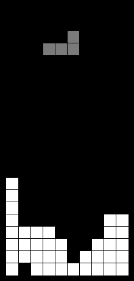

# Learning to play Tetris with Monte Carlo Tree Search and Temporal Difference Learning

My personal project for the love of Tetris.

(Warning: Codes are a hot mess riddled with inconsistent styles and unclear namings, read them at your own risk.)

(Warning2: I have been experimenting with a lot of things lately, so some of the features may not work properly. If you intend to reproduce my earlier results, make sure you check out my previous commits.)

## Introduction

This project started out as a practice to apply Deep Q-Learning to Tetris, one of my favourite puzzle games of all time. 
However, I soon realized that it was almost impossible to train an agent to perform anywhere near human level possibly
due to the sparsity and long-term dependency of the rewards in Tetris (imagine how many actions you need to perform to clear even one 
line!). It was also around that time AlphaGo beat Lee Sedol in a dominating fashion that reignited my hopes for a better agent. Also,
I believed that a model based approach should improve significantly compared to model free approaches (Q learning, policy gradients etc.). So here it is, the MCTS-TD agent inspired by AlphaGo specializing in the game Tetris.

## How is this related to AlphaGO/Zero?
At the core of AlphaGo, the agent tries to search the game tree base on upper confidence bound applied to trees (UCT). Unlike vanilla MCTS which has to simulate the entire game to estimate the value of the current state, AlphaGo uses a neural network to inference the value (winning probability) and the policy (likely next moves) of the current state to calculate the upper confidence bound for each move. In my agent, I used exponential moving averages and variances with initial values from the neural network to calculate the upper confidence bound based on central limit theorem which I believe is more appropriate for single player games with unbounded rewards. Another difference is that AlphaGo uses the final scores of each game as the training targets while this agent uses a bootstrapped target, hence Temporal Difference Learning.

## How is this different from other Tetris Bots?
Most of the super-human performing Tetris bots seen on youtube or other games use heuristics (number of holes, height of each column, smoothness of the surface etc.) to model the reward. Using heuristics can substantially simplify the problem since the rewards are now much denser (you get a reward for each piece you drop or each action you did) and are highly correlated with the final score. 
However, such handcrafted rewards can bias your agents toward the target you set (e.g. minimize holes in the board or height of the column) instead of the true target (clearing lines). Furthermore, such heuristics do not generalize beyond the game Tetris meaning that you have to handcraft rewards for each game you want your bot to play. This agent differs from those bots in the sense that it can be applied to any environment satisfying certain requirements.

## Prerequisite

See `requirements.txt`

You'll also need the Tetris environment from [here](https://github.com/hrpan/pyTetris), and the Python/C++ binding library [pybind11](https://github.com/pybind/pybind11).

## Training your agent

You can now train your agent with a single command:

`python play.py --agent_type ValueSimLP --online --ngames 1000 --mcts_sims 100`

## Results

### Version 1.0
See the agent in action [here](https://www.youtube.com/watch?v=EALo2GfZuYU)!

The agent was trained with 300 simulations per move (SPM) and each training iteration consisted of 100 games.
In each iteration, a benchmark game with 1500 SPM was also played to assert the agent's performance.

     

    <em> Averaged and standard deviation of line clears from training/benchmark games. (Left: training; Right: benchmark.) </em>

### Version 2.0
See the evolution of the agent [here](https://www.youtube.com/watch?v=v-p-36f5YMw)!

The reward function was replaced by the one used in [the official guideline](https://tetris.wiki/Scoring).
Training games were played with 500 SPM, and benchmark games were played with 1000 SPM.
Instead of training only on the actual visited states, states travelled during MCTS were also used as training data.

Achieved 5678 line clears with 1000 SPM after 750 training episodes. Had to terminate because I ran out of RAM. 

     

    <em> Average and standard deviation of scores and line clears at each iteration. (Left: training; Right: benchmark). </em>

### Version 3.0
???

## Further Readings
1. [Reinforcement Learning: An Introduction](https://mitpress.mit.edu/books/reinforcement-learning-second-edition) (Must read for anyone interested in reinforcement learning)
2. [Playing Atari with Deep Reinforcement Learning](https://arxiv.org/abs/1312.5602) (First deep reinforcement learning)
3. [A Survey of Monte Carlo Tree Search Methods](https://ieeexplore.ieee.org/document/6145622) (Great review of MCTS)
4. [Transpositions and Move Groups in Monte Carlo Tree Search](https://ieeexplore.ieee.org/document/5035667) (An important branch reduction technique for MCTS)
5. [Bandit Algorithm](http://banditalgs.com/) (Contains almost everything you need to know about bandit-like algorithms)
6. [Deep Learning](https://www.deeplearningbook.org/) (Great introductory book on deep learning)
7. [Mastering the game of Go without human knowledge](https://www.nature.com/articles/nature24270) (Original AlphaGo Zero paper)
8. [Deep Reinforcement Learning: Pong from Pixels](http://karpathy.github.io/2016/05/31/rl/) (Great introductory article on deep reinforcement learning)
9. [The Game of Tetris in Machine Learning](https://arxiv.org/abs/1905.01652) (Great introduction to the history of Tetris in machine learning)
10. [Playing Tetris with Deep Reinforcement Learning](http://cs231n.stanford.edu/reports/2016/pdfs/121_Report.pdf) (A short report on DQN applied to Tetris)
